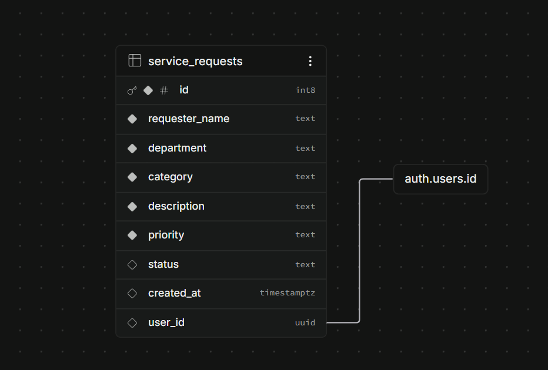
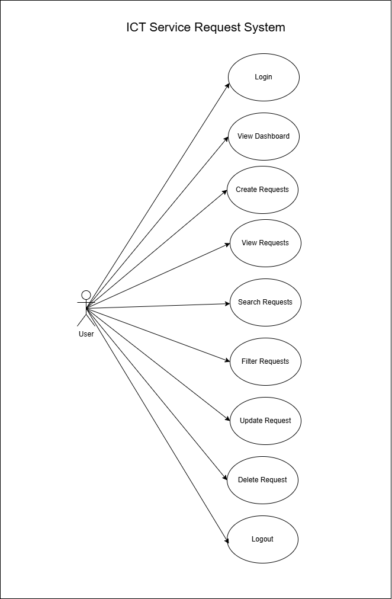

# ICT Service Request Management System

A small web-based system for a university ICT office to record and manage
technical support requests, built for Laboratory Exercise 3 (Systems Analysis
and Design). Front end is plain HTML/CSS/JavaScript hosted on GitHub Pages;
data storage, authentication, and access control are handled by Supabase.

Full SAD analysis (problem statement, actors, use case diagram, ERD) is in
[`documentation/system-analysis.md`](documentation/system-analysis.md).

---

## 1. Problem Statement

See [`documentation/system-analysis.md`](documentation/system-analysis.md#1-problem-statement).

## 2. ERD



## 3. Sequence Diagram


---

## 4. Project Structure

```
sad-service-request/
│
├── index.html              # Dashboard + CRUD table + search/filter + analytics
├── login.html               # Login page
│
├── css/
│   └── style.css             # All styling
│
├── js/
│   ├── supabase.js            # Supabase client init (URL + anon key)
│   ├── auth.js                 # Login, logout, session guard
│   └── app.js                   # Dashboard, CRUD, search/filter, analytics
│
├── supabase/
│   └── schema.sql                # Table definition + RLS policies
│
├── documentation/
│   └── system-analysis.md         # Problem statement, actors, use cases, ERD
│
└── README.md
```

## 5. Setup Instructions

1. **Create a Supabase project** at [supabase.com](https://supabase.com).
2. **Run the schema.** Open the SQL Editor in your Supabase project and run
   the contents of [`supabase/schema.sql`](supabase/schema.sql). This creates
   the `service_requests` table and enables Row Level Security with the four
   policies described in the lab spec.
3. **Create at least one test account** under
   `Authentication → Users → Add user` (or enable sign-ups and register one).
4. **Get your API credentials** from `Project Settings → API`:
   - Project URL
   - `anon` / `publishable` key
5. **Configure the client.** Open [`js/supabase.js`](js/supabase.js) and
   replace the two placeholder constants:
   ```js
   const SUPABASE_URL = "https://your-project.supabase.co";
   const SUPABASE_KEY = "your-publishable-or-anon-key";
   ```
   Never put the `service_role` key here — only the anon/publishable key is
   safe to ship in a static, publicly hosted front end.
6. **Run locally.** Because the app uses `fetch` under the hood via the
   Supabase client, serve the folder over HTTP rather than opening the file
   directly (`file://`) — for example:
   ```bash
   npx serve .
   # or
   python3 -m http.server 8080
   ```
   Then visit `http://localhost:8080/login.html`.

## 6. Deployment (GitHub Pages)

1. Push this repository to GitHub as `SAD-ServiceRequest-Lastname`.
2. Go to **Settings → Pages → Build and deployment**.
3. Set **Source** to *Deploy from a branch*, **Branch** to `main`, folder
   `/(root)`.
4. Wait for the deployment to finish, then open:
   `https://username.github.io/SAD-ServiceRequest-Lastname/login.html`

## 7. Requirements Traceability Matrix

| Req. ID | Requirement | System Feature | Test |
|---|---|---|---|
| FR-01 | User can log in | `login.html`, `auth.js` | TC-01 |
| FR-02 | User can create request | New Request modal, `app.js: createRequest()` | TC-02 |
| FR-03 | User can view requests | Requests table, `app.js: loadRequests()` | TC-03 |
| FR-04 | User can update request | Edit modal, `app.js: updateRequest()` | TC-04 |
| FR-05 | User can delete request | Delete button + confirm, `app.js: deleteRequest()` | TC-05 |
| FR-06 | User can search | Search box, `app.js: applyFiltersAndRender()` | TC-06 |
| FR-07 | User can filter | Status/Priority selects, `app.js: applyFiltersAndRender()` | TC-07 |
| FR-08 | System displays summaries | Dashboard cards, `app.js: renderDashboard()` | TC-08 |

Business-rule traceability (BR-01 through BR-10) is documented in
[`documentation/system-analysis.md`](documentation/system-analysis.md#5-business-rules-implemented).

## 8. Functional Testing

| Test ID | Test Scenario | Expected Result | Result |
|---|---|---|---|
| TC-01 | Login using valid account | Dashboard appears | ☐ PASS / ☐ FAIL |
| TC-02 | Submit valid request | Request saved | ☐ PASS / ☐ FAIL |
| TC-03 | Display requests | Existing records appear | ☐ PASS / ☐ FAIL |
| TC-04 | Modify request | Changes saved | ☐ PASS / ☐ FAIL |
| TC-05 | Delete request | Confirmation appears and record is removed | ☐ PASS / ☐ FAIL |
| TC-06 | Search requester | Matching records displayed | ☐ PASS / ☐ FAIL |
| TC-07 | Filter Pending requests | Only Pending records displayed | ☐ PASS / ☐ FAIL |
| TC-08 | Open deployed URL | Application loads online | ☐ PASS / ☐ FAIL |

Fill in PASS/FAIL after testing your own deployment and take screenshots for
submission.

## 9. Optional Enhancement — Request Analytics

`index.html` includes a **Request Analytics** section (By Category, By
Priority) below the requests table. Counts are computed client-side from the
live Supabase data returned by `loadRequests()` — nothing is hard-coded.

## 10. Security Notes

- Only the Supabase **anon/publishable** key is used in the front end.
- All write access is enforced server-side through **Row Level Security**
  (`supabase/schema.sql`), not just by hiding buttons in the UI — a user who
  is authenticated but does not own a row cannot update or delete it even by
  calling the API directly (BR-10).
- Passwords/test credentials are **not** included in this README; submit
  them separately through the LMS as instructed in the lab spec.


